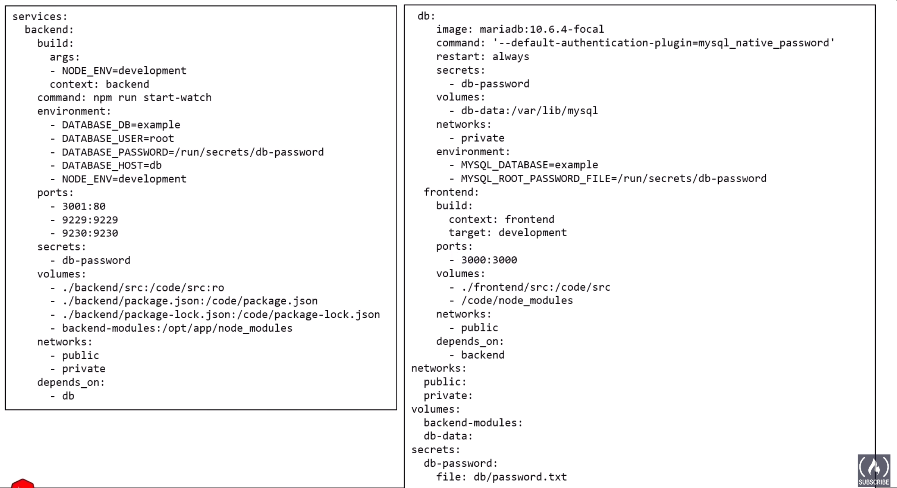
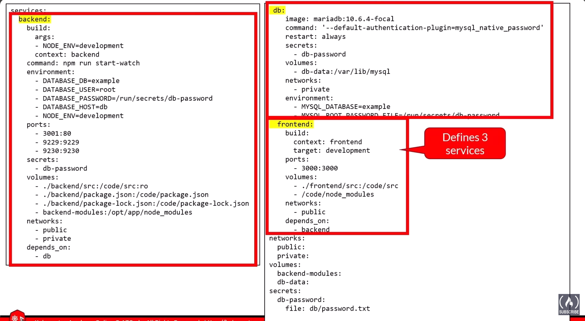
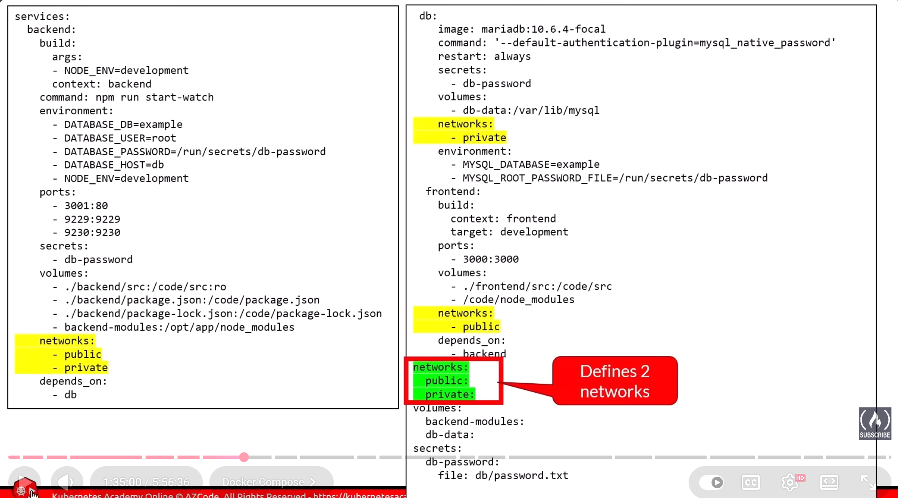
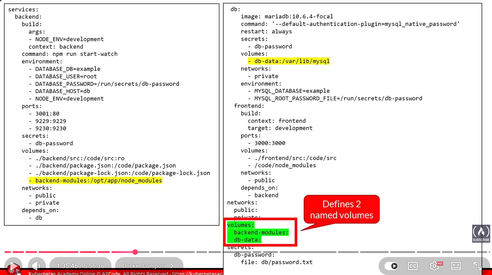
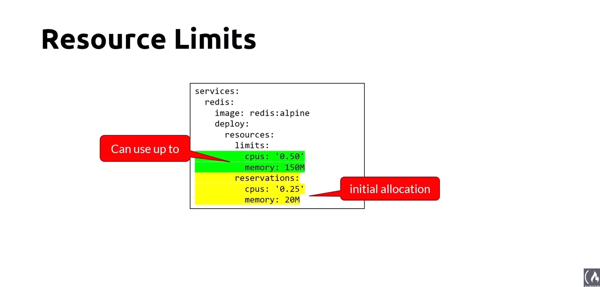

## Sample APP

React -> Node -> MariaDB

Steps:

Define 3 services:

1- backend
2- db:
3- frontend 

context refers to the folder like 

context: backend ->docker file -> backend 

it a folder where docker file is located 

Next defining 2 networks:

-> Public
-> Private

as frontend service is using the public network

backend service use public and private network 

and db is uing only private network 

as frontend is not using private so can't communicate with the db but as db has both private and public it can communicate with db and frontend both.

Define 2 Volumns:

1- backend-module -> for backend
2- db-data -> for db 

So after this just run docker compose up  for building or recrweate  or start the container

docker compose ps for lisitng 

docker compose down to bring down what was up 

## Resource Limits

Yellow is the intial resources and green one are the limit of using the resources

Practice

Feb-26/practice/compose-node-app